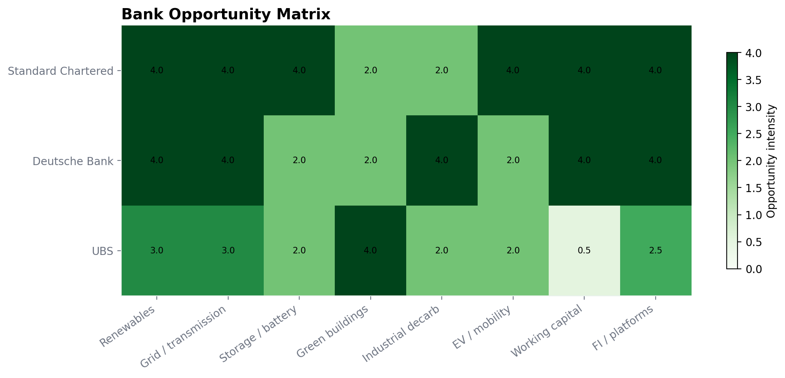

<div align="center">

# 🌿 India Sustainable Finance — Commercial Layer

**A portfolio-grade sustainable finance strategy engine for India's energy transition.**

[](https://python.org)
[](https://github.com/DogInfantry/sustainable-finance-india-transition/actions)
[](LICENSE)
[]()

> Combines an India transition financing roadmap, a rule-based product mapping engine, and
> bank-specific positioning for **Standard Chartered · Deutsche Bank · UBS** —
> reproducible from source with a single command.

[📋 Roadmap](#-india-transition-roadmap) · [⚙️ Product Engine](#️-product-mapping-engine) · [🏦 Bank Views](#-bank-positioning) · [📊 Outputs](#-outputs-at-a-glance) · [🚀 Run It](#-how-to-run)

</div>

---

## ✦ What Makes This Different

| Principle | How It's Applied |
|-----------|------------------|
| **Verified-only bank claims** | All bank positioning sourced exclusively from official public materials — annual reports, sustainability frameworks, press releases. Unverified gaps are explicitly marked `not verified`, never filled with assumptions. |
| **Single-command reproducibility** | `python build.py` regenerates all reports, figures, and appendix tables from source data — no manual steps. |
| **Rule-based transparency** | Product recommendations use explicit, explainable scoring criteria — not black-box models. Every weight and bias is inspectable in `src/taxonomy.py`. |
| **CI-enforced integrity** | GitHub Actions runs tests and rebuilds outputs on every push and pull request. |
| **Illustrative scenarios, clearly labelled** | Scenario numbers are financing anchors, not forecasts. Assumption register lives at `reports/assumption_register.csv`. |

---

## 📋 India Transition Roadmap

A country-level financing roadmap mapping capital requirements across India's clean energy and industrial transition — sized, split by subsector, and allocated across capital channels.

**Subsectors covered:**
- Renewables (solar, wind, hybrid)
- Grid modernisation & storage
- Green buildings & EV ecosystems
- Industrial decarbonisation (cement, steel, chemicals)
- Circular economy & waste-to-energy

**Capital channels modelled:**
- Bank balance sheet (project finance, corporate loans)
- Public capital markets (green bonds, SLBs, transition bonds)
- Blended / DFI pools (guarantees, first-loss tranches)
- Carbon-linked flows

📄 Full report → [`reports/india_transition_financing_roadmap.md`](./reports/india_transition_financing_roadmap.md)


---

## ⚙️ Product Mapping Engine

A rule-based engine that scores financing structures against use cases using 9 transparent criteria — prioritising explainability over statistical optimisation.

### Scoring Criteria

| Criterion | What It Captures |
|-----------|------------------|
| Capex intensity | Scale of upfront capital requirement |
| Project / portfolio size | Absolute deal size and aggregation need |
| Risk-sharing fit | Whether DFI or guarantee structures are warranted |
| KPI readiness | Availability of measurable, verifiable sustainability KPIs |
| Use-of-proceeds clarity | Green bond eligibility; earmarking feasibility |
| Transition stage | Early-stage vs. scale-up vs. refinancing |
| Borrower type | PSU, private corporate, NBFC, developer |
| Bond-market readiness | Credit profile, size, and investor appetite |
| Subsector commercial biases | Sector-specific product preferences and precedents |

### Instrument Taxonomy

- Green project finance and corporate green loans
- Green bonds and green securitisation
- Sustainability-linked loans, RCFs, and bonds
- Transition finance loans and transition bond variants
- Warehouse and aggregation facilities
- Refinancing and take-out structures
- Guarantees and partial risk-sharing facilities
- Blended finance and carbon-linked structures
- Advisory-led green / transition capital-markets solutions

📄 Full playbook → [`reports/product_mapping_playbook.md`](./reports/product_mapping_playbook.md)


---

## 🏦 Bank Positioning

Comparative analysis of how three global banks are publicly positioned in sustainable and transition finance — sourced exclusively from verified official materials.

| Bank | Public Positioning | Source Basis |
|------|--------------------|-------------|
| **Standard Chartered** | EM-focused sustainable finance; explicit India transition strategy; blended finance leadership | Annual report, sustainability framework, India pages |
| **Deutsche Bank** | European anchor with growing EM transition coverage; ESG advisory depth | Sustainability report, product framework pages |
| **UBS** | Wealth-led sustainable investing; institutional green bond distribution; impact advisory | Annual report, sustainability report, press releases |

> All claims are anchored to `data/bank_source_ledger.csv`. Unverified gaps are labelled explicitly — never inferred.

📄 Full analysis → [`reports/bank_views_SC_DB_UBS.md`](./reports/bank_views_SC_DB_UBS.md)



---

## 📊 Outputs at a Glance

### Reports
| File | Description |
|------|-------------|
| [`india_transition_financing_roadmap.md`](./reports/india_transition_financing_roadmap.md) | Country roadmap — subsector sizing, capital channel allocation |
| [`product_mapping_playbook.md`](./reports/product_mapping_playbook.md) | Full product scoring methodology and recommendations |
| [`bank_views_SC_DB_UBS.md`](./reports/bank_views_SC_DB_UBS.md) | Verified bank positioning — StanChart, DB, UBS |
| [`strategy_appendix.md`](./reports/strategy_appendix.md) | Borrower archetypes, sector priority matrix, extended analysis |

### Data & Appendices
| File | Description |
|------|-------------|
| [`product_mapping_table.csv`](./reports/product_mapping_table.csv) | Full product-to-use-case scoring matrix |
| [`bank_comparison_matrix.csv`](./reports/bank_comparison_matrix.csv) | Side-by-side bank capability comparison |
| [`assumption_register.csv`](./reports/assumption_register.csv) | All scenario weights and illustrative assumptions |
| [`source_confidence_register.csv`](./reports/source_confidence_register.csv) | Per-claim source and confidence classification |
| [`data/bank_source_ledger.csv`](./data/bank_source_ledger.csv) | Primary source references for all bank claims |

---

## 🗂️ Repository Structure

```
sustainable-finance-india-transition/  (feature/commercial-layer)
│
├── 📁 .github/workflows/ci.yml          # GitHub Actions — test + rebuild on push
├── 📄 build.py                           # Single-command pipeline: reports + figures + CSVs
├── 📄 requirements.txt
├── 📄 pytest.ini
├── 📁 data/
│   ├── bank_source_ledger.csv             # Verified source references for bank claims
│   ├── example_corporate_profiles.csv     # Illustrative borrower archetypes
│   ├── india_transition_needs.csv         # Subsector financing anchor data
│   └── product_taxonomy.csv               # Full instrument taxonomy
├── 📁 src/
│   ├── taxonomy.py                        # Product scoring rules & weights
│   ├── scenarios.py                       # Subsector sizing & capital channel splits
│   ├── bank_views.py                      # Bank positioning logic
│   ├── figures.py                         # Chart generation
│   └── reporting.py                       # Markdown & CSV report assembly
├── 📁 figures/                            # Auto-generated PNG outputs
├── 📁 reports/                            # Auto-generated markdown reports + CSV appendices
├── 📁 notebooks/                          # Exploratory Jupyter workflows (transparency)
│   ├── 01_india_transition_gap.ipynb
│   ├── 02_product_mapping_engine.ipynb
│   └── 03_bank_views_SC_DB_UBS.ipynb
└── 📁 tests/                              # pytest test suite
```

---

## 🚀 How To Run

```bash
# Clone and install
git clone https://github.com/DogInfantry/sustainable-finance-india-transition.git
cd sustainable-finance-india-transition
git checkout feature/commercial-layer
pip install -r requirements.txt

# Regenerate everything — reports, figures, appendix tables
python build.py
```

That single command regenerates:
- All markdown reports in `reports/`
- All portfolio figures in `figures/`
- All appendix CSV tables in `reports/`

To run tests:
```bash
pytest
```

---

## ⚠️ Limitations & Assumptions

- **Scenario numbers are illustrative** — financing anchors, not market-size forecasts or investment advice
- **Borrower archetypes are fictional** — included only to demonstrate product-fit logic
- **Product scoring is rule-based by design** — prioritises explainability over statistical optimisation
- **Bank strategy** combines verified public positioning with clearly labelled analyst inference
- *Not investment advice. Not affiliated with Standard Chartered, Deutsche Bank, UBS, or any other institution.*

---

## 🔗 Related

| Repository | Focus |
|------------|-------|
| [`main` branch](https://github.com/DogInfantry/sustainable-finance-india-transition/tree/main) | Research frameworks — green bond valuation, ESG scoring, climate risk models, SEBI/RBI policy |
| [capital-markets-intelligence](https://github.com/DogInfantry/capital-markets-intelligence) | IPO event studies, M&A screening, sovereign risk index, yield curve decomposition |
| [investment-risk-management-console](https://github.com/DogInfantry/investment-risk-management-console) | Real-time Nifty 50 risk dashboard, stress testing, sector attribution |

---

## 📜 License

MIT License — see [LICENSE](LICENSE). Attribution appreciated.

---

<div align="center">

**Last Updated:** April 2026 &nbsp;·&nbsp; **Branch:** `feature/commercial-layer` &nbsp;·&nbsp; **Status:** 🟢 Active

*Verified sources · Single-command reproducibility · Built for sustainable finance practitioners*

</div>
