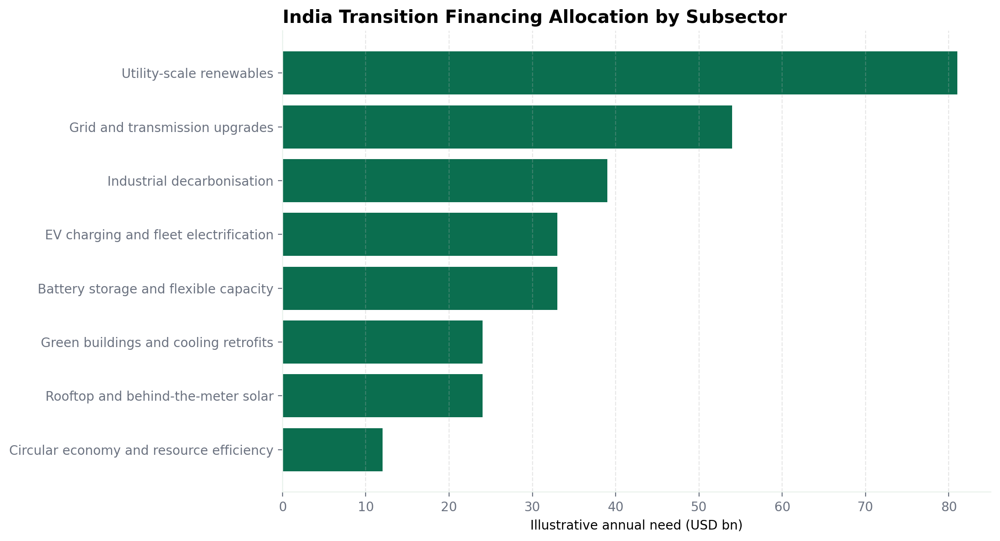
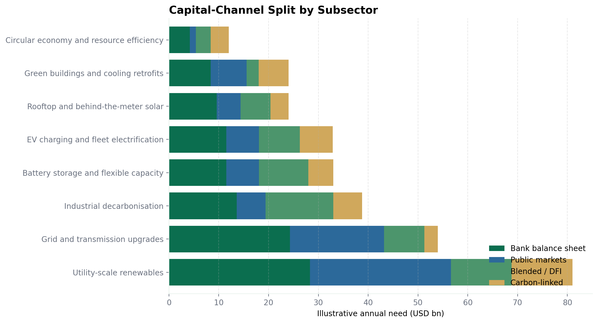

# India Clean Energy / ESG Financing Roadmap

## Executive Summary

- India's transition financing need is large enough that banks cannot rely on one product family. A practical market build-out needs project finance for contracted assets, green bonds for refinancing and scale, and sustainability-linked structures for diversified corporates and hard-to-abate sectors. [SC3][DB3][DB4]
- The cleanest near-term opportunity set is operating renewables, grid-linked capex, green buildings and distributed-energy portfolios where use-of-proceeds debt can be tied to clearly eligible assets. [SC2][SC5][DB5]
- Industrial decarbonisation, EV ecosystems and fragmented supply chains need more flexible structures: SLLs, transition finance and ESG-linked working-capital lines should be treated as core products, not side products. [SC2][SC4][DB2]

## India Transition Context

Standard Chartered's February 2026 India transition survey says Indian corporates increasingly view green and sustainability-linked loans and bonds as the most relevant instruments, with carbon-market interest rising as the market matures. [SC3] Deutsche Bank's India transition coverage frames the same market through rising power demand, renewable build-out and the need for parallel investment in grid resilience and storage. [DB3][DB6]

For this repository, the country-level annual financing stack is anchored to a **directional** public signal that India's transition could require roughly USD 300 billion per year over time, then split across subsectors using clearly labeled illustrative assumptions. Those subsector allocations are scenario inputs for product mapping, not verified market forecasts. [SC3]

## Financing Allocation Snapshot

## Illustrative Annual Investment Stack

| subsector | central_case_annual_investment_usd_bn | share_of_total_pct | capex_intensity | risk_profile | roadmap_commentary |
| --- | --- | --- | --- | --- | --- |
| Utility-scale renewables | 81.0 | 27.0 | high | core-plus | Project finance is the cleanest lead product for contracted greenfield assets; green bonds become more efficient after commissioning or for portfolio refinancing. |
| Grid and transmission upgrades | 54.0 | 18.0 | high | core | Long-dated project or corporate infrastructure loans work earlier in the build cycle, while bonds are better once regulated or availability-based assets are operating. |
| Industrial decarbonisation | 39.0 | 13.0 | high | opportunistic | SLLs and transition finance fit best when the borrower needs balance-sheet flexibility and KPI-linked incentives, not a narrow green capex bucket. |
| Battery storage and flexible capacity | 33.0 | 11.0 | high | core-plus | Use-of-proceeds debt works when contracted revenues are visible; blended structures help where merchant exposure or policy support is still evolving. |
| EV charging and fleet electrification | 33.0 | 11.0 | medium | core-plus | SLLs and ESG-linked working capital fit scaling operators better than standalone bonds; warehouse and blended structures help aggregate small assets. |
| Rooftop and behind-the-meter solar | 24.0 | 8.0 | medium | core-plus | Warehouse lines, on-lending facilities and green securitisation are more scalable than single-asset bonds in fragmented distributed portfolios. |
| Green buildings and cooling retrofits | 24.0 | 8.0 | medium | core-plus | Green loans and green bonds suit ring-fenced capex, while SLLs fit diversified real-estate groups with enterprise-wide efficiency KPIs. |
| Circular economy and resource efficiency | 12.0 | 4.0 | medium | core-plus | Working-capital lines, SLLs and carbon-linked revenue support can unlock smaller-ticket projects that are too fragmented for public bonds. |

## Product Logic

- **Project finance beats bond financing** when assets are still under construction, cash flows can be ring-fenced in an SPV, and lenders need tighter covenant control over completion, reserve accounts and step-in rights. Deutsche Bank's project-finance guidance explicitly frames the structure as cash-flow-based and suited to capital-intensive infrastructure. [DB4]
- **Green bonds beat project loans** once issuers have operating assets, repeat issuance needs and a reporting setup that can support portfolio refinancing at scale. Standard Chartered's public sustainable finance messaging and Deutsche Bank's India renewables financing coverage both point to bonds as part of the refinancing and scale-up toolkit. [SC6][DB5]
- **SLLs fit better than green loans** when the funding need is general corporate purpose, the capex plan is broad rather than ring-fenced, or the borrower is in a hard-to-abate sector where transition KPIs matter more than strict green taxonomy eligibility. [SC2][DB2][UBS5]
- **ESG-linked working capital** is the better fit for EPCs, suppliers and mobility ecosystems where the balance-sheet need is short dated and tied to procurement cycles or receivables rather than long-life assets. [SC4][DB5]

## Funding Mix Archetypes

| archetype | debt_pct | equity_pct | blended_concessional_pct | carbon_and_other_pct | debt_usd_bn | equity_usd_bn | blended_concessional_usd_bn | carbon_and_other_usd_bn |
| --- | --- | --- | --- | --- | --- | --- | --- | --- |
| Base-case | 62.0 | 25.0 | 10.0 | 3.0 | 186.0 | 75.0 | 30.0 | 9.0 |
| Accelerated transition | 55.0 | 22.0 | 18.0 | 5.0 | 165.0 | 66.0 | 54.0 | 15.0 |

## Capital-Pool View

| subsector | bank_balance_sheet_usd_bn | public_markets_usd_bn | blended_dfi_usd_bn | carbon_markets_usd_bn |
| --- | --- | --- | --- | --- |
| Utility-scale renewables | 28.3 | 28.3 | 12.2 | 12.2 |
| Grid and transmission upgrades | 24.3 | 18.9 | 8.1 | 2.7 |
| Industrial decarbonisation | 13.6 | 5.8 | 13.6 | 5.8 |
| Battery storage and flexible capacity | 11.5 | 6.6 | 9.9 | 5.0 |
| EV charging and fleet electrification | 11.5 | 6.6 | 8.2 | 6.6 |
| Rooftop and behind-the-meter solar | 9.6 | 4.8 | 6.0 | 3.6 |
| Green buildings and cooling retrofits | 8.4 | 7.2 | 2.4 | 6.0 |
| Circular economy and resource efficiency | 4.2 | 1.2 | 3.0 | 3.6 |

## Roadmap by Phase

| phase | priority | actions | products |
| --- | --- | --- | --- |
| 0-12 months | Win refinancing and shovel-ready assets | Prioritise operating renewables, smart-metering, certified buildings and grid-linked capex where use-of-proceeds debt can close quickly. Build SLL pipelines for industrial and mobility borrowers that are not yet green-bond ready. | Green project finance, green corporate loans, green bonds, SLLs, ESG-linked working capital. |
| 12-36 months | Scale portfolio platforms and transition pathways | Aggregate distributed solar, storage, EV and retrofit assets into warehouse or securitisation-ready pools. Structure transition finance programmes for steel, cement and chemicals with milestone-based KPI calibration. | Green bonds, green securitisation, transition loans, SLBs, blended finance platforms. |
| 3-5 years | Industrialise capital markets and blended pools | Move mature portfolios to repeat issuance, crowd in insurers and wealth capital, and use blended or carbon-linked structures for harder technologies such as green hydrogen, long-duration storage and process decarbonisation. | Programmatic green bonds, transition bonds, securitisation, blended finance, carbon finance. |

## Related Files

- [Transition subsectors](../data/india_transition_needs.csv)
- [Source ledger](../data/bank_source_ledger.csv)
- [Product mapping playbook](./product_mapping_playbook.md)

## Notes and Disclaimers

- All subsector investment figures in this report are **illustrative scenario allocations** used to test product fit. They are not market-size claims and should not be cited as forecasts.
- Verified facts in the narrative above are limited to official public materials from Standard Chartered, Deutsche Bank and UBS. Where bank-specific public evidence was not found, the repository labels the point as not verified rather than filling the gap with inference.
- This repository is an educational work sample and not investment advice.

## Sources

- **SC2** Climate change - [source](https://www.sc.com/en/about/sustainability/position-statements/climate-change/)
- **SC3** New report from Standard Chartered highlights optimistic corporate outlook on India's energy transition (2026-02-10) - [source](https://www.sc.com/in/news-media/sc-highlights-optimistic-corporate-outlook-on-indias-energy-transition/)
- **SC4** Sustainable trade financing - [source](https://www.sc.com/en/corporate-investment-banking/transaction-banking/sustainable-trade-financing/)
- **SC5** Apraava Energy secures USD 92 million from British International Investment (2025-12-03) - [source](https://www.sc.com/in/news-media/apraava-energy-investment/)
- **SC6** Annual Report 2025 Sustainability Review (2026-03-31) - [source](https://www.sc.com/en/uploads/sites/66/content/docs/annual-report-2025-sustainability-review.pdf)
- **DB2** Deutsche Bank sets new 2030 sustainable and transition finance target and publishes its initial Transition Finance Framework (2025-11-17) - [source](https://www.db.com/news/detail/20251117-deutsche-bank-sets-new-2030-sustainable-and-transition-finance-target-and-publishes-its-initial-transition-finance-framework?language_id=1)
- **DB3** India's path to net zero - [source](https://flow.db.com/more/esg/india-s-path-to-net-zero?language_id=1)
- **DB4** Project finance explained (2025-07-16) - [source](https://flow.db.com/Topics/trade-finance/project-finance-explained?language_id=1)
- **DB5** REC: financing India's renewable energy strategy (2) (2025-01-15) - [source](https://flow.db.com/case-studies/rec-financing-indias-renewable-energy-strategy-2)
- **DB6** REC: supporting India's renewable energy strategy (1) (2025-01-15) - [source](https://flow.db.com/case-studies/rec-supporting-india-s-renewable-energy-strategy-1)
- **UBS5** Sustainability Report Supplement 2025 (2026-03-13) - [source](https://www.ubs.com/global/en/investor-relations/financial-information/annual-reporting/_jcr_content/root/contentarea/mainpar/toplevelgrid_1041865/col_2/linklistreimagined_c/link_copy.0290640933.file/PS9jb250ZW50L2RhbS9hc3NldHMvY2MvaW52ZXN0b3ItcmVsYXRpb25zL2FubnVhbC1yZXBvcnQvMjAyNS9zdXN0YWluYWJpbGl0eS1yZXBvcnQtc3VwcGxlbWVudC0yMDI1LnBkZg%3D%3D/sustainability-report-supplement-2025.pdf)
