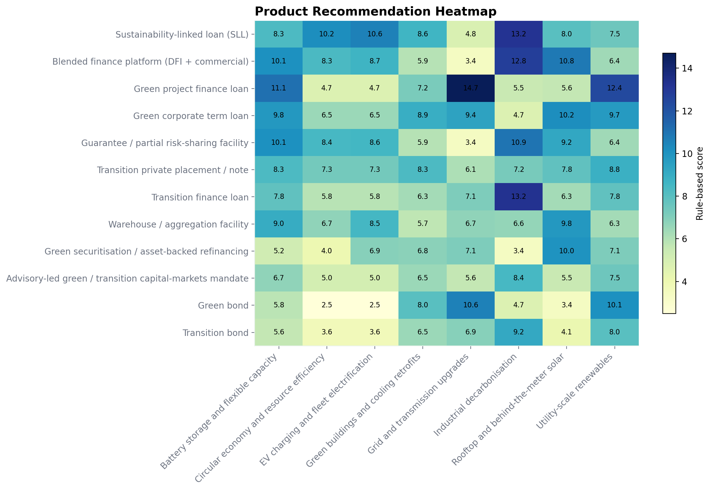

# Product Mapping Playbook

## Product Taxonomy Overview

The product set is split deliberately between **use-of-proceeds** instruments and **sustainability-linked or transition** instruments. That matters in India: use-of-proceeds debt is strongest where asset eligibility is clear, while SLLs and transition facilities are more effective when the borrower needs balance-sheet flexibility or is decarbonising hard-to-abate operations. [SC1][SC2][DB2][UBS5]

### Use-of-Proceeds Products

| Product | Product Family | Best use case | Typical borrower / issuer | Key KPIs or covenants | Advantages | Risks / limitations |
| --- | --- | --- | --- | --- | --- | --- |
| Green project finance loan | use of proceeds | Greenfield or brownfield renewable, storage and grid assets with ring-fenced cash flows and bankable contracts. | Developers, utilities, infrastructure funds | Construction completion tests, DSCR, reserve accounts, EPC and O&M covenants, eligible green asset tests | Strong lender control, long tenor, suited to SPVs and syndication for large assets | Execution risk during construction, documentation intensity, less efficient for small fragmented assets |
| Green corporate term loan | use of proceeds | Use-of-proceeds financing for eligible capex, retrofit programmes or portfolio build-out at the corporate level. | Corporates, developers, real-estate owners, financial institutions | Eligible use-of-proceeds schedule, reporting undertakings, leverage and cash-sweep terms where relevant | Faster than bond issuance, flexible drawdown, works for repeat capex programmes | Needs clear asset eligibility and reporting discipline; tenor is shorter than project finance |
| Green bond | use of proceeds | Portfolio refinancing, operating asset take-outs and repeat funding for issuers with credible reporting and market access. | Investment-grade corporates, utilities, infrastructure funds, financial institutions | Use-of-proceeds ring-fencing, allocation reporting, impact reporting, negative pledge or standard bond covenants | Scalable refinancing tool, opens institutional capital pools, lowers dependence on bank balance sheets | Requires market access, disclosure readiness and sufficient issuance size; less efficient during construction |
| Green securitisation / asset-backed refinancing | use of proceeds | Refinancing diversified pools of operating assets such as rooftop solar, EV receivables or efficiency portfolios. | Financial institutions, NBFCs, aggregators, infrastructure funds | Pool eligibility criteria, delinquency triggers, over-collateralisation, servicing and reporting covenants | Recycles balance-sheet capacity and matches fragmented operating assets to institutional demand | Requires asset history, data quality and standardisation; execution is inefficient before portfolios season |
| Warehouse / aggregation facility | use of proceeds | Bridge and warehouse funding for fragmented clean-asset portfolios before securitisation, bond issuance or take-out. | NBFCs, aggregators, distributed solar platforms, EV and storage originators | Borrowing-base tests, concentration limits, asset-eligibility criteria, amortisation triggers | Ideal for distributed assets that are too small for direct bond markets and need aggregation first | Relies on servicing quality, collateral data and reliable take-out strategy |
| Refinancing / take-out facility | use of proceeds | Replacement of construction debt once operating history exists, often ahead of public-market issuance. | Developers, infrastructure funds, utilities | Operating history tests, minimum DSCR, refinancing timeline, distribution lock-up triggers | Creates a practical bridge from bank construction debt to institutional capital | Needs operating history and clear visibility on permanent capital take-out |

### Sustainability-Linked and Transition Products

| Product | Product Family | Best use case | Typical borrower / issuer | Key KPIs or covenants | Advantages | Risks / limitations |
| --- | --- | --- | --- | --- | --- | --- |
| Guarantee / partial risk-sharing facility | transition | Credit enhancement, first-loss support or risk-sharing for newer technologies, SME borrowers or transition portfolios. | DFIs, guarantors, commercial banks, platform lenders | Coverage ratio, portfolio eligibility, claim mechanics, reporting and utilization tests | Improves bankability where tenor, technology or borrower quality would otherwise be constrained | Availability depends on guarantor appetite; claim structures can be complex |
| Sustainability-linked loan (SLL) | sustainability-linked | General corporate purpose or capex financing where pricing is linked to borrower-level sustainability KPIs. | Corporates, EPCs, mobility operators, financial institutions | SPTs tied to emissions, renewable share, energy intensity, recycling, safety or supply-chain metrics; margin ratchet | Works even when funds are not ring-fenced, good transition tool for diversified borrowers, can scale across relationship banks | KPI calibration can be weak if targets are not ambitious; reputational risk if SPTs are not credible |
| Sustainability-linked revolving credit facility | sustainability-linked | KPI-linked revolving liquidity for diversified corporates and operating businesses with variable funding needs. | Corporates, EPCs, manufacturers, exporters | Sustainability margin ratchet, liquidity covenant package, annual KPI assurance | Well suited to working-capital variability and treasury-led adoption of sustainability-linked financing | Shorter tenor and limited direct capex linkage reduce visibility for pure asset financing |
| Sustainability-linked bond (SLB) | sustainability-linked | Capital markets financing for larger issuers that can commit to public transition KPIs and step-up structures. | Large corporates and utilities with public debt access | Public SPTs, coupon step-up or alternative economics, annual assurance and external review | Balance-sheet flexibility with public-market sizing and visible transition signaling | Public scrutiny is high, weak targets are penalized, and sub-investment-grade execution can be volatile |
| Transition finance loan | transition | Financing for decarbonisation pathways in hard-to-abate sectors where assets or plans may not be fully green today. | Steel, cement, chemicals, transport, diversified industrial corporates | Transition plan milestones, capex deployment tests, emissions-intensity pathways, leverage and liquidity covenants | Useful where activities are transition-enabling but not fully taxonomy-green; preserves bank dialogue on strategy | Framework scrutiny is high; eligibility boundaries can be contentious and transaction preparation can be heavy |
| Transition bond | transition | Capital markets instrument for transition capex or refinancing under a documented transition framework. | Large corporates and utilities in hard-to-abate sectors | Transition framework, eligible project list or transition-plan disclosures, reporting and assurance | Diversifies funding for large transition issuers and can refinance multiple projects at once | Investor acceptance depends on framework credibility and issuer disclosure quality |
| KPI-linked transition bond | transition | Hybrid transition instrument combining public KPI commitments with broader transition funding flexibility. | Large corporates and utilities with transition frameworks | Transition KPIs, coupon step-up, annual progress reporting, external review | Useful when issuers need both transition signaling and balance-sheet flexibility | Execution can be difficult if investors see KPIs as weak or transition plan as incomplete |
| Transition private placement / note | transition | Private debt or note placement for issuers that want transition financing without full benchmark-bond execution. | Large mid-cap corporates, infrastructure platforms, family-owned industrial groups | Investor reporting package, transition disclosures, leverage and incurrence covenant suite | Broadens investor access for issuers that are not frequent public benchmark borrowers | Pricing and investor depth can be less predictable than syndicated or benchmark bonds |
| ESG-linked working capital / sustainable trade finance | sustainability-linked | Supply-chain finance, letters of credit, receivables and working-capital lines tied to sustainability performance or eligible trade flows. | EPCs, manufacturers, exporters, mobility operators, financial institutions | Working-capital borrowing base, sustainability margin ratchet, supplier onboarding criteria, eligible trade-flow tests | Fits procurement and execution cycles, can reach supply chains, useful bridge before term debt or bonds | Short tenor and operational complexity; not a substitute for long-dated capex finance |
| Blended finance platform (DFI + commercial) | transition | Higher-risk, first-loss or concessional structures for new technologies, underserved segments or early-market platforms. | Developers, financial institutions, platform aggregators, public-private partnerships | Concessional tranche terms, eligibility criteria, policy-linked milestones, reporting to catalytic capital providers | Crowds in commercial lenders, absorbs early-stage risk, useful for storage, distributed assets and nascent technologies | Structuring is slower, concessional capital is scarce, and governance can be complex |
| Carbon finance / results-based finance | transition | Revenue support or incentive structures linked to verified emissions reductions, carbon credits or outcomes-based programmes. | Project developers, industrial corporates, building portfolios, platform operators | Monitoring, reporting and verification, credit issuance rules, delivery obligations, buffer or reserve mechanics | Can improve project economics for efficiency, nature and early-transition projects that need incremental revenue | Price volatility, policy uncertainty and verification complexity limit bankability as a stand-alone funding source |
| Advisory-led green / transition capital-markets mandate | advisory | Green, transition or sustainability-linked bond and private-placement advisory for issuers preparing institutional capital raises. | Issuers with capital-markets ambitions, utilities, infrastructure funds, large corporates | Framework readiness, investor positioning, disclosure package, second-party opinion or review process | Important scaling tool once issuers are ready to move from bank-led financing to institutional capital | Not a funding instrument on its own; depends on successful market execution and issuer readiness |

## Subsector to Product Mapping

### Utility-scale renewables

| Product | Family | Type | Score | Rationale |
| --- | --- | --- | --- | --- |
| Green project finance loan | use of proceeds | loan | 12.4 | supports the capex profile; matches expected ticket size or portfolio scale; fits the risk-sharing need; has KPI mechanics the borrower can likely support; works with the clarity of eligible use-of-proceeds; fits the transition stage; aligns with asset-level infrastructure financing; matches the dominant financing pattern for this subsector |
| Green bond | use of proceeds | bond | 10.1 | supports the capex profile; matches expected ticket size or portfolio scale; fits the risk-sharing need; has KPI mechanics the borrower can likely support; works with the clarity of eligible use-of-proceeds; fits the transition stage; benefits from bond-market access and refinancing capacity; matches the dominant financing pattern for this subsector |
| Green corporate term loan | use of proceeds | loan | 9.7 | supports the capex profile; matches expected ticket size or portfolio scale; fits the risk-sharing need; has KPI mechanics the borrower can likely support; works with the clarity of eligible use-of-proceeds; fits the transition stage; matches the dominant financing pattern for this subsector |

### Rooftop and behind-the-meter solar

| Product | Family | Type | Score | Rationale |
| --- | --- | --- | --- | --- |
| Blended finance platform (DFI + commercial) | transition | blended | 10.8 | supports the capex profile; matches expected ticket size or portfolio scale; fits the risk-sharing need; has KPI mechanics the borrower can likely support; works with the clarity of eligible use-of-proceeds; fits the transition stage; works for on-lending or portfolio funding models; matches the dominant financing pattern for this subsector |
| Green corporate term loan | use of proceeds | loan | 10.2 | supports the capex profile; matches expected ticket size or portfolio scale; fits the risk-sharing need; has KPI mechanics the borrower can likely support; works with the clarity of eligible use-of-proceeds; fits the transition stage; works for on-lending or portfolio funding models; matches the dominant financing pattern for this subsector |
| Green securitisation / asset-backed refinancing | use of proceeds | structured | 10.0 | supports the capex profile; matches expected ticket size or portfolio scale; fits the risk-sharing need; has KPI mechanics the borrower can likely support; works with the clarity of eligible use-of-proceeds; works for on-lending or portfolio funding models; can aggregate fragmented operating assets; matches the dominant financing pattern for this subsector |

### Grid and transmission upgrades

| Product | Family | Type | Score | Rationale |
| --- | --- | --- | --- | --- |
| Green project finance loan | use of proceeds | loan | 14.7 | supports the capex profile; matches expected ticket size or portfolio scale; fits the risk-sharing need; has KPI mechanics the borrower can likely support; works with the clarity of eligible use-of-proceeds; fits the transition stage; aligns with asset-level infrastructure financing; fits long-dated infrastructure construction risk; matches the dominant financing pattern for this subsector |
| Green bond | use of proceeds | bond | 10.6 | supports the capex profile; matches expected ticket size or portfolio scale; fits the risk-sharing need; has KPI mechanics the borrower can likely support; works with the clarity of eligible use-of-proceeds; fits the transition stage; benefits from bond-market access and refinancing capacity; matches the dominant financing pattern for this subsector |
| Refinancing / take-out facility | use of proceeds | loan | 10.1 | supports the capex profile; matches expected ticket size or portfolio scale; fits the risk-sharing need; has KPI mechanics the borrower can likely support; works with the clarity of eligible use-of-proceeds; fits the transition stage; matches the dominant financing pattern for this subsector |

### Battery storage and flexible capacity

| Product | Family | Type | Score | Rationale |
| --- | --- | --- | --- | --- |
| Green project finance loan | use of proceeds | loan | 11.1 | supports the capex profile; matches expected ticket size or portfolio scale; fits the risk-sharing need; has KPI mechanics the borrower can likely support; works with the clarity of eligible use-of-proceeds; fits the transition stage; aligns with asset-level infrastructure financing; matches the dominant financing pattern for this subsector |
| Blended finance platform (DFI + commercial) | transition | blended | 10.1 | supports the capex profile; matches expected ticket size or portfolio scale; fits the risk-sharing need; has KPI mechanics the borrower can likely support; works with the clarity of eligible use-of-proceeds; fits the transition stage; matches the dominant financing pattern for this subsector |
| Guarantee / partial risk-sharing facility | transition | guarantee | 10.1 | supports the capex profile; matches expected ticket size or portfolio scale; fits the risk-sharing need; has KPI mechanics the borrower can likely support; works with the clarity of eligible use-of-proceeds; fits the transition stage; matches the dominant financing pattern for this subsector |

### Green buildings and cooling retrofits

| Product | Family | Type | Score | Rationale |
| --- | --- | --- | --- | --- |
| Green corporate term loan | use of proceeds | loan | 8.9 | supports the capex profile; matches expected ticket size or portfolio scale; fits the risk-sharing need; has KPI mechanics the borrower can likely support; works with the clarity of eligible use-of-proceeds; fits the transition stage; matches the dominant financing pattern for this subsector |
| Sustainability-linked loan (SLL) | sustainability-linked | loan | 8.6 | supports the capex profile; matches expected ticket size or portfolio scale; fits the risk-sharing need; has KPI mechanics the borrower can likely support; works with the clarity of eligible use-of-proceeds; fits the transition stage; matches the dominant financing pattern for this subsector |
| Transition private placement / note | transition | bond | 8.3 | supports the capex profile; matches expected ticket size or portfolio scale; fits the risk-sharing need; has KPI mechanics the borrower can likely support; works with the clarity of eligible use-of-proceeds; fits the transition stage; benefits from bond-market access and refinancing capacity |

### EV charging and fleet electrification

| Product | Family | Type | Score | Rationale |
| --- | --- | --- | --- | --- |
| Sustainability-linked loan (SLL) | sustainability-linked | loan | 10.6 | supports the capex profile; matches expected ticket size or portfolio scale; fits the risk-sharing need; has KPI mechanics the borrower can likely support; works with the clarity of eligible use-of-proceeds; fits the transition stage; preserves balance-sheet flexibility for diversified corporates; matches the dominant financing pattern for this subsector |
| Blended finance platform (DFI + commercial) | transition | blended | 8.65 | supports the capex profile; matches expected ticket size or portfolio scale; fits the risk-sharing need; has KPI mechanics the borrower can likely support; works with the clarity of eligible use-of-proceeds; fits the transition stage; matches the dominant financing pattern for this subsector |
| Guarantee / partial risk-sharing facility | transition | guarantee | 8.55 | supports the capex profile; matches expected ticket size or portfolio scale; fits the risk-sharing need; has KPI mechanics the borrower can likely support; works with the clarity of eligible use-of-proceeds; fits the transition stage; matches the dominant financing pattern for this subsector |

### Industrial decarbonisation

| Product | Family | Type | Score | Rationale |
| --- | --- | --- | --- | --- |
| Transition finance loan | transition | loan | 13.25 | supports the capex profile; matches expected ticket size or portfolio scale; fits the risk-sharing need; has KPI mechanics the borrower can likely support; works with the clarity of eligible use-of-proceeds; fits the transition stage; is suited to hard-to-abate transition pathways; matches the dominant financing pattern for this subsector |
| Sustainability-linked loan (SLL) | sustainability-linked | loan | 13.2 | supports the capex profile; matches expected ticket size or portfolio scale; fits the risk-sharing need; has KPI mechanics the borrower can likely support; works with the clarity of eligible use-of-proceeds; fits the transition stage; preserves balance-sheet flexibility for diversified corporates; is suited to hard-to-abate transition pathways; matches the dominant financing pattern for this subsector |
| Blended finance platform (DFI + commercial) | transition | blended | 12.75 | supports the capex profile; matches expected ticket size or portfolio scale; fits the risk-sharing need; has KPI mechanics the borrower can likely support; works with the clarity of eligible use-of-proceeds; fits the transition stage; is suited to hard-to-abate transition pathways; matches the dominant financing pattern for this subsector |

### Circular economy and resource efficiency

| Product | Family | Type | Score | Rationale |
| --- | --- | --- | --- | --- |
| Sustainability-linked loan (SLL) | sustainability-linked | loan | 10.2 | supports the capex profile; matches expected ticket size or portfolio scale; fits the risk-sharing need; has KPI mechanics the borrower can likely support; works with the clarity of eligible use-of-proceeds; fits the transition stage; preserves balance-sheet flexibility for diversified corporates; matches the dominant financing pattern for this subsector |
| Guarantee / partial risk-sharing facility | transition | guarantee | 8.45 | supports the capex profile; matches expected ticket size or portfolio scale; fits the risk-sharing need; has KPI mechanics the borrower can likely support; works with the clarity of eligible use-of-proceeds; fits the transition stage; matches the dominant financing pattern for this subsector |
| Blended finance platform (DFI + commercial) | transition | blended | 8.35 | supports the capex profile; matches expected ticket size or portfolio scale; fits the risk-sharing need; has KPI mechanics the borrower can likely support; works with the clarity of eligible use-of-proceeds; fits the transition stage; matches the dominant financing pattern for this subsector |

## Corporate Use-Case Mini Case Studies

The fictional borrower set below is intentionally realistic but invented. It is designed to show how the same bank toolkit changes when borrower type, credit profile and transition stage change.

### IndGrid Renewables Ltd

| Recommended product | Family | Score | Why it fits |
| --- | --- | --- | --- |
| Green bond | use of proceeds | 15.1 | supports the capex profile; matches expected ticket size or portfolio scale; fits the risk-sharing need; has KPI mechanics the borrower can likely support; works with the clarity of eligible use-of-proceeds; fits the transition stage; benefits from bond-market access and refinancing capacity; matches the dominant financing pattern for this subsector; matches the borrower's current funding objective |
| Green project finance loan | use of proceeds | 14.2 | supports the capex profile; matches expected ticket size or portfolio scale; fits the risk-sharing need; has KPI mechanics the borrower can likely support; works with the clarity of eligible use-of-proceeds; fits the transition stage; aligns with asset-level infrastructure financing; matches the dominant financing pattern for this subsector; matches the borrower's current funding objective |
| Transition bond | transition | 13.0 | supports the capex profile; matches expected ticket size or portfolio scale; fits the risk-sharing need; has KPI mechanics the borrower can likely support; works with the clarity of eligible use-of-proceeds; fits the transition stage; benefits from bond-market access and refinancing capacity; matches the borrower's current funding objective |

### NavaGrid Transmission Services

| Recommended product | Family | Score | Why it fits |
| --- | --- | --- | --- |
| Green project finance loan | use of proceeds | 16.5 | supports the capex profile; matches expected ticket size or portfolio scale; fits the risk-sharing need; has KPI mechanics the borrower can likely support; works with the clarity of eligible use-of-proceeds; fits the transition stage; aligns with asset-level infrastructure financing; fits long-dated infrastructure construction risk; matches the dominant financing pattern for this subsector; matches the borrower's current funding objective |
| Green bond | use of proceeds | 13.2 | supports the capex profile; matches expected ticket size or portfolio scale; fits the risk-sharing need; has KPI mechanics the borrower can likely support; works with the clarity of eligible use-of-proceeds; benefits from bond-market access and refinancing capacity; matches the dominant financing pattern for this subsector; matches the borrower's current funding objective |
| Green corporate term loan | use of proceeds | 10.1 | supports the capex profile; matches expected ticket size or portfolio scale; fits the risk-sharing need; has KPI mechanics the borrower can likely support; works with the clarity of eligible use-of-proceeds; fits the transition stage; matches the dominant financing pattern for this subsector; matches the borrower's current funding objective |

### Bharat Steel & Metals

| Recommended product | Family | Score | Why it fits |
| --- | --- | --- | --- |
| Transition finance loan | transition | 13.25 | supports the capex profile; matches expected ticket size or portfolio scale; fits the risk-sharing need; has KPI mechanics the borrower can likely support; works with the clarity of eligible use-of-proceeds; fits the transition stage; is suited to hard-to-abate transition pathways; matches the dominant financing pattern for this subsector |
| Sustainability-linked loan (SLL) | sustainability-linked | 13.2 | supports the capex profile; matches expected ticket size or portfolio scale; fits the risk-sharing need; has KPI mechanics the borrower can likely support; works with the clarity of eligible use-of-proceeds; fits the transition stage; preserves balance-sheet flexibility for diversified corporates; is suited to hard-to-abate transition pathways; matches the dominant financing pattern for this subsector |
| Blended finance platform (DFI + commercial) | transition | 12.75 | supports the capex profile; matches expected ticket size or portfolio scale; fits the risk-sharing need; has KPI mechanics the borrower can likely support; works with the clarity of eligible use-of-proceeds; fits the transition stage; is suited to hard-to-abate transition pathways; matches the dominant financing pattern for this subsector |

### Saras EV Mobility

| Recommended product | Family | Score | Why it fits |
| --- | --- | --- | --- |
| Sustainability-linked loan (SLL) | sustainability-linked | 13.8 | supports the capex profile; matches expected ticket size or portfolio scale; fits the risk-sharing need; has KPI mechanics the borrower can likely support; works with the clarity of eligible use-of-proceeds; fits the transition stage; captures the borrower's working-capital need; preserves balance-sheet flexibility for diversified corporates; matches the dominant financing pattern for this subsector; matches the borrower's current funding objective |
| Guarantee / partial risk-sharing facility | transition | 11.75 | supports the capex profile; matches expected ticket size or portfolio scale; fits the risk-sharing need; has KPI mechanics the borrower can likely support; works with the clarity of eligible use-of-proceeds; fits the transition stage; captures the borrower's working-capital need; matches the dominant financing pattern for this subsector; matches the borrower's current funding objective |
| Warehouse / aggregation facility | use of proceeds | 11.7 | supports the capex profile; matches expected ticket size or portfolio scale; fits the risk-sharing need; has KPI mechanics the borrower can likely support; works with the clarity of eligible use-of-proceeds; fits the transition stage; captures the borrower's working-capital need; matches the dominant financing pattern for this subsector; matches the borrower's current funding objective |

### Aarohan Green Parks REIT

| Recommended product | Family | Score | Why it fits |
| --- | --- | --- | --- |
| Green bond | use of proceeds | 12.5 | supports the capex profile; fits the risk-sharing need; has KPI mechanics the borrower can likely support; works with the clarity of eligible use-of-proceeds; fits the transition stage; benefits from bond-market access and refinancing capacity; matches real-estate portfolio refinancing needs; matches the dominant financing pattern for this subsector; matches the borrower's current funding objective |
| Transition private placement / note | transition | 11.2 | supports the capex profile; matches expected ticket size or portfolio scale; fits the risk-sharing need; has KPI mechanics the borrower can likely support; works with the clarity of eligible use-of-proceeds; fits the transition stage; benefits from bond-market access and refinancing capacity |
| Transition bond | transition | 11.0 | supports the capex profile; fits the risk-sharing need; has KPI mechanics the borrower can likely support; works with the clarity of eligible use-of-proceeds; fits the transition stage; benefits from bond-market access and refinancing capacity; matches the borrower's current funding objective |

### Prakash EPC Services

| Recommended product | Family | Score | Why it fits |
| --- | --- | --- | --- |
| Sustainability-linked loan (SLL) | sustainability-linked | 13.76 | supports the capex profile; matches expected ticket size or portfolio scale; fits the risk-sharing need; has KPI mechanics the borrower can likely support; works with the clarity of eligible use-of-proceeds; fits the transition stage; captures the borrower's working-capital need; preserves balance-sheet flexibility for diversified corporates; matches the dominant financing pattern for this subsector; matches the borrower's current funding objective |
| Guarantee / partial risk-sharing facility | transition | 12.01 | supports the capex profile; matches expected ticket size or portfolio scale; fits the risk-sharing need; has KPI mechanics the borrower can likely support; works with the clarity of eligible use-of-proceeds; fits the transition stage; captures the borrower's working-capital need; matches the dominant financing pattern for this subsector; matches the borrower's current funding objective |
| Blended finance platform (DFI + commercial) | transition | 10.51 | supports the capex profile; matches expected ticket size or portfolio scale; fits the risk-sharing need; has KPI mechanics the borrower can likely support; works with the clarity of eligible use-of-proceeds; fits the transition stage; captures the borrower's working-capital need; matches the dominant financing pattern for this subsector |

### Shakti Climate Finance NBFC

| Recommended product | Family | Score | Why it fits |
| --- | --- | --- | --- |
| Blended finance platform (DFI + commercial) | transition | 12.24 | supports the capex profile; matches expected ticket size or portfolio scale; fits the risk-sharing need; has KPI mechanics the borrower can likely support; works with the clarity of eligible use-of-proceeds; fits the transition stage; captures the borrower's working-capital need; works for on-lending or portfolio funding models; matches the dominant financing pattern for this subsector |
| Green corporate term loan | use of proceeds | 11.64 | supports the capex profile; matches expected ticket size or portfolio scale; fits the risk-sharing need; has KPI mechanics the borrower can likely support; works with the clarity of eligible use-of-proceeds; fits the transition stage; captures the borrower's working-capital need; works for on-lending or portfolio funding models; matches the dominant financing pattern for this subsector |
| Warehouse / aggregation facility | use of proceeds | 11.24 | supports the capex profile; matches expected ticket size or portfolio scale; fits the risk-sharing need; has KPI mechanics the borrower can likely support; works with the clarity of eligible use-of-proceeds; fits the transition stage; captures the borrower's working-capital need; matches the dominant financing pattern for this subsector |

## Related Files

- [Expanded product taxonomy](../data/product_taxonomy.csv)
- [CSV product mapping table](./product_mapping_table.csv)
- [Portfolio appendix](./strategy_appendix.md)

## Notes

- Product scoring is rule-based and explainable. It is intentionally transparent rather than optimized as a black-box model.
- Warehouse lines, guarantees, take-out facilities and advisory-led capital-markets mandates are included to reflect how real sustainable-finance toolkits move from origination to scale-up and distribution.

## Sources

- **SC1** Bespoke sustainable finance solutions - [source](https://www.sc.com/en/about/sustainability/bespoke-sustainable-finance-solutions/)
- **SC2** Climate change - [source](https://www.sc.com/en/about/sustainability/position-statements/climate-change/)
- **SC4** Sustainable trade financing - [source](https://www.sc.com/en/corporate-investment-banking/transaction-banking/sustainable-trade-financing/)
- **DB1** Sustainable & Transition Finance - [source](https://www.db.com/what-we-do/responsibility/sustainability/sustainable-finance?kid=sustainability-finance.redirect-en.shortcut&language_id=1)
- **DB2** Deutsche Bank sets new 2030 sustainable and transition finance target and publishes its initial Transition Finance Framework (2025-11-17) - [source](https://www.db.com/news/detail/20251117-deutsche-bank-sets-new-2030-sustainable-and-transition-finance-target-and-publishes-its-initial-transition-finance-framework?language_id=1)
- **DB5** REC: financing India's renewable energy strategy (2) (2025-01-15) - [source](https://flow.db.com/case-studies/rec-financing-indias-renewable-energy-strategy-2)
- **UBS2** Our offering - [source](https://www.ubs.com/global/en/sustainability-impact/our-offering.html)
- **UBS4** Sustainability Report 2025 (2026-03-13) - [source](https://www.ubs.com/global/en/sustainability-impact/sustainability-reporting/_jcr_content/root/contentarea/mainpar/toplevelgrid/col_1/tabteaser/tabteasersplit_61486_1647868169/innergrid_1976054452/col_1/linklistreimagined_c/link.1262138256.file/PS9jb250ZW50L2RhbS9hc3NldHMvY2MvaW52ZXN0b3ItcmVsYXRpb25zL2FubnVhbC1yZXBvcnQvMjAyNS9zdXN0YWluYWJpbGl0eS1yZXBvcnQtMjAyNS5wZGY%3D/sustainability-report-2025.pdf)
- **UBS5** Sustainability Report Supplement 2025 (2026-03-13) - [source](https://www.ubs.com/global/en/investor-relations/financial-information/annual-reporting/_jcr_content/root/contentarea/mainpar/toplevelgrid_1041865/col_2/linklistreimagined_c/link_copy.0290640933.file/PS9jb250ZW50L2RhbS9hc3NldHMvY2MvaW52ZXN0b3ItcmVsYXRpb25zL2FubnVhbC1yZXBvcnQvMjAyNS9zdXN0YWluYWJpbGl0eS1yZXBvcnQtc3VwcGxlbWVudC0yMDI1LnBkZg%3D%3D/sustainability-report-supplement-2025.pdf)
